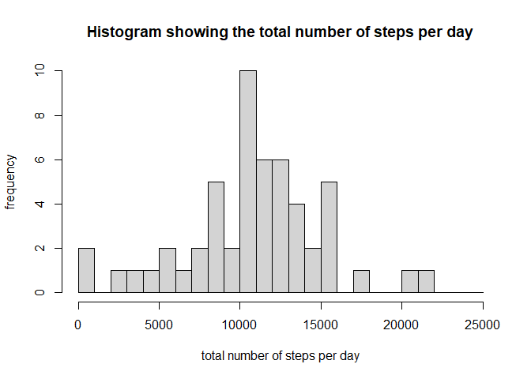
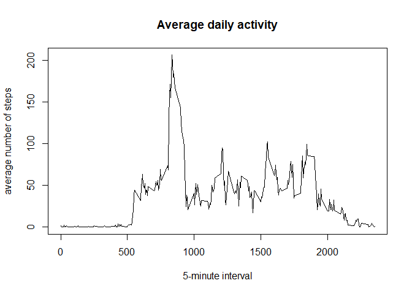
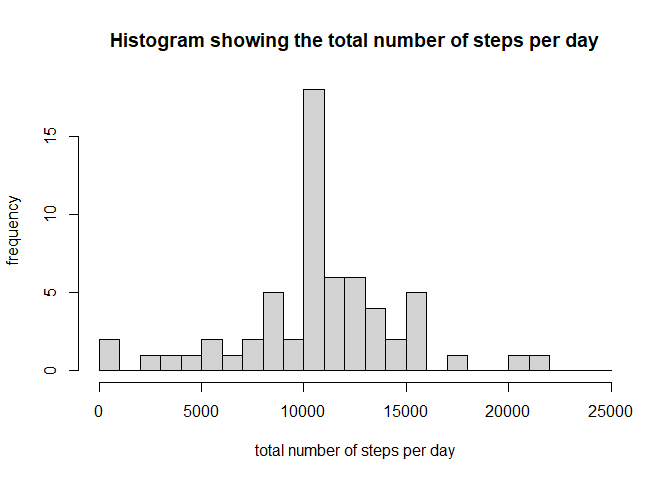
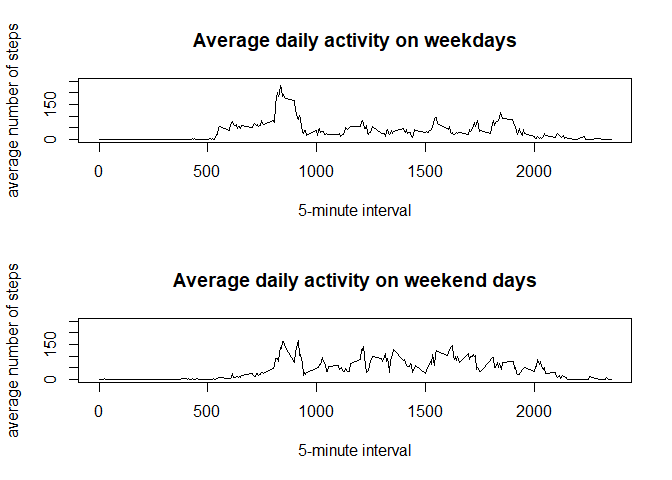

## Loading and preprocessing the data

The dataset is called 'activity' and is loaded into R. Furthermore the class of the date column is changed from character to date.


```r
data <- read.csv("activity.csv", header = TRUE)
data$date <- as.Date(data$date)
```


## What is mean total number of steps taken per day?

The total number of steps per day are calculated and stored in the variable 'totalsteps'. Furthermore a histogram is made to show the distribution of the total number of steps per day. Using the variable 'totalsteps' the mean and median of the total number of steps per day are calculated. 


```r
totalsteps <- with(data, tapply(steps, date, sum))
hist(totalsteps, breaks=seq(0,25000,1000), 
      main = "Histogram showing the total number of steps per day", 
      xlab = "total number of steps per day",
      ylab = "frequency")
```

<!-- -->

```r
mean(totalsteps, na.rm = TRUE)
```

```
## [1] 10766.19
```

```r
median(totalsteps, na.rm = TRUE)
```

```
## [1] 10765
```

## What is the average daily activity pattern?

To make a plot of the average daily activity, the mean number of steps per 5-minute interval is calculated and stored in the variable 'intervalsteps'. A plot shows the change in average number of steps throughout the day. Also the 5-minute interval with the maximum number of steps is determined. 


```r
intervalsteps <- with(data, tapply(steps, interval, mean, na.rm = TRUE))
xaxis <- data$interval[1:288]
plot(xaxis, intervalsteps, type = "l", main = "Average daily activity",
     xlab = "5-minute interval", ylab = "average number of steps")
```

<!-- -->

```r
# 5-minute interval with maximum number of steps:
intervalsteps[intervalsteps == max(intervalsteps)]
```

```
##      835 
## 206.1698
```

## Imputing missing values

The total number of missing values is calculated. On the position of missing values a value is added by using the mean number of steps during that 5-minute interval. The dataset in which missing values are replaced is called data2.

```r
# The total number of missing values in the steps column in the dataset:
sum(is.na(data$steps))
```

```
## [1] 2304
```

```r
# Imputing missing values:
data2 <- data
data2$interval <- as.character(data2$interval)
for(i in 1:nrow(data2)){
        if (is.na(data2[i,1]) == TRUE){
                data2[i,1] = intervalsteps[data2[i,3]] 
        } 
}
```

The total number of steps per day are calculated again for the new dataset and stored in the variable 'totalsteps2'. A histogram is made and the mean and median of 'totalsteps2' are calculated. 

```r
totalsteps2 <- with(data2, tapply(steps, date, sum))
hist(totalsteps2, breaks=seq(0,25000,1000), 
      main = "Histogram showing the total number of steps per day", 
      xlab = "total number of steps per day",
      ylab = "frequency")
```

<!-- -->

```r
mean(totalsteps2, na.rm = TRUE)
```

```
## [1] 10766.19
```

```r
median(totalsteps2, na.rm = TRUE)
```

```
## [1] 10766.19
```
It can be seen that the mean of 'totalsteps' and 'totalsteps2' are the same. This was to be expected since mean values where added to the dataset. The median of 'totalsteps' and 'totalsteps2' are not equal. The median of 'totalsteps2' is actually equal to the mean. 

## Are there differences in activity patterns between weekdays and weekends?

To dataset 'data2' a new column is added to show whether a date corresponds to a weekday or a day in the weekend. 


```r
library(dplyr, warn.conflicts=F, quietly=T)
Sys.setlocale("LC_TIME", "English")
```


```r
data2 <- mutate(data2, day = factor(1*(weekdays(date)=="Saturday"|weekdays(date)=="Sunday"),
                            labels = c("weekday", "weekend")))
```

A plot is made to show the average number of steps per 5-minute interval separately for weekdays and weekend days. 


```r
data2$interval <- as.integer(data2$interval)
intervalsteps2 <- with(data2, tapply(steps, list(day,interval), mean))
# plot
par(mfrow = c(2,1))
plot(xaxis, intervalsteps2[1,], type = "l", main = "Average daily activity on weekdays", xlab = "5-minute interval", ylab = "average number of steps", ylim=c(0,250))
plot(xaxis, intervalsteps2[2,], type = "l", main = "Average daily activity on weekend days", xlab = "5-minute interval", ylab = "average number of steps", ylim=c(0,250))
```

<!-- -->

